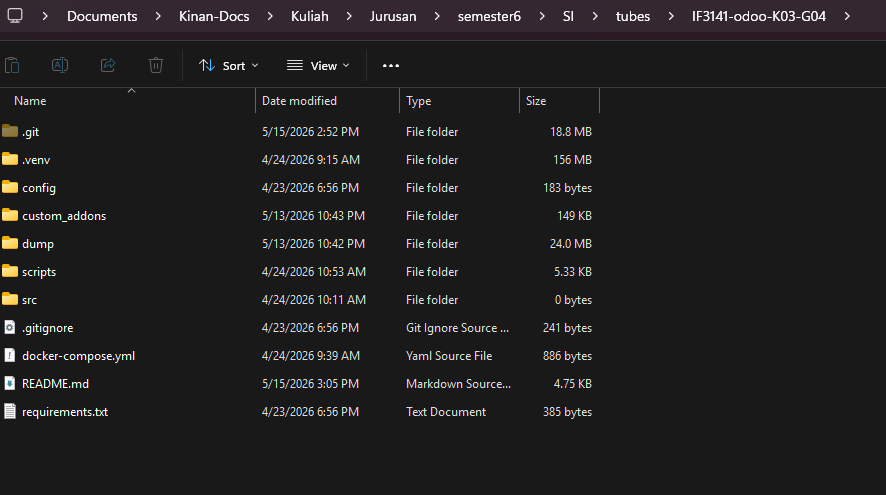
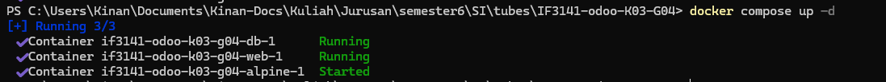
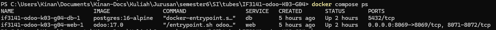
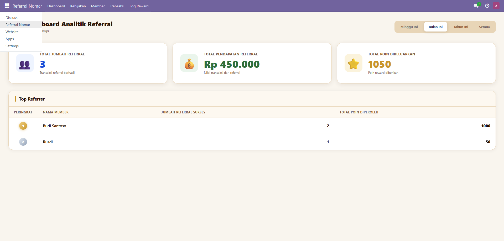
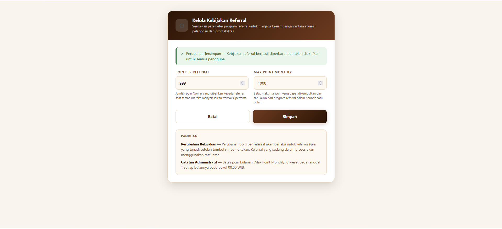
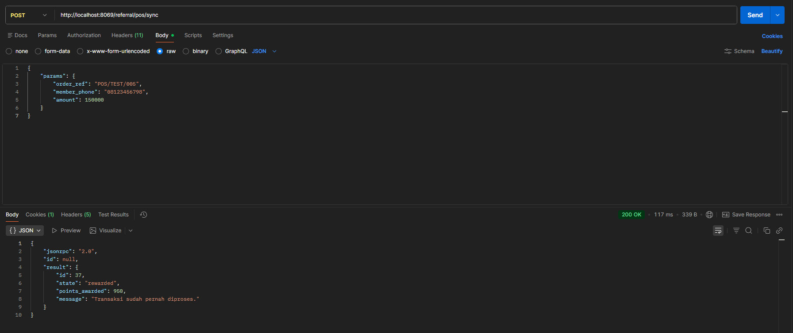

# Sistem Informasi Customer Referral Program

## Informasi Kelompok
- **Nama dan Nomor Kelompok:** Kelompok 04 (G04)
- **Nomor Kelas:** K03

## Anggota Kelompok
- 13523123 - Rhio Bimo Prakoso Sugiyanto
- 13523135 - Ahmad Syafiq
- 13523137 - Muhammad Aulia Azka
- 13523148 - Andrew Tedjapratama
- 13523152 - Muhammad Kinan Arkansyaddad

## Informasi Sistem
- **Nama Sistem:** Sistem Informasi Customer Referral Program
- **Nama Perusahaan:** PT. Nomar Kopi Indonesia

## Deskripsi Sistem
Sistem Informasi Customer Referral Program PT Nomar Kopi Indonesia adalah sebuah sistem yang dirancang untuk mendukung proses akuisisi pelanggan baru secara terukur, terdigitalisasi, dan terotomasi. Sistem ini dibangun sebagai transformasi dari strategi pemasaran perusahaan yang sebelumnya masih sangat bergantung pada pendekatan konvensional seperti pemasaran dari mulut ke mulut dan media sosial. Dalam implementasinya, sistem referal ini juga dirancang agar dapat terintegrasi dengan ekosistem perangkat lunak yang telah dioperasikan oleh pihak perusahaan.

Secara fungsional, sistem ini memberikan fasilitas kepada pelanggan yang berstatus sebagai member aktif untuk memperoleh tautan atau kode referral unik yang dapat didistribusikan kepada calon pelanggan baru. Ketika calon pelanggan tersebut berhasil mendaftar, melakukan transaksi, dan kode referral tersebut tervalidasi, sistem akan memetakan transaksi tersebut kepada akun member pengajak. Selanjutnya, sistem akan secara otomatis memberikan poin insentif atau reward kepada pihak pengajak berdasarkan aturan dan kebijakan yang telah ditetapkan secara terpusat oleh manajemen perusahaan.

## Cara Menjalankan Sistem

### Prasyarat

- Docker & Docker Compose
- Git
- Port `8069` tersedia di mesin lokal

### Langkah 1 — Clone Repository

```bash
git clone <URL_REPOSITORY>
cd <nama-folder-repository>
```

**Expected Result:** Folder project berhasil ter-clone dan berisi direktori `referral_dashboard/`, `referral_registration/`, serta `docker-compose.yml`.


***

### Langkah 2 — Jalankan Docker Compose

```bash
docker compose up -d
```

Tunggu hingga container `web` dan `db` berstatus `healthy` (kurang lebih 60–120 detik).


```bash
docker compose ps
```

**Expected Result:**


***

### Langkah 3 — Akses Odoo & Instalasi Modul

1. Buka browser → `http://localhost:8069`
2. Login menggunakan kredensial **Administrator** (lihat bagian Kredensial)
3. Aktifkan **Developer Mode**: buka `Settings → General Settings → scroll ke bawah → Activate Developer Mode`
4. Buka `Apps → Update Apps List`
5. Cari `Referral Dashboard` dan `Referral Registration`, kemudian klik **Install** untuk keduanya

**Expected Result:** Menu **"Referral Nomar"** muncul di navigasi atas Odoo dengan sub-menu Dashboard, Kebijakan, Member, Transaksi, dan Log Reward.

***

### Langkah 4 — Konfigurasi Kebijakan Awal (Role: Admin)

1. Buka **Referral Nomar → Kebijakan**
2. Isi parameter:
   - **Poin per Referral:** `100`
   - **Max Point Monthly:** `500`
3. Klik **Simpan**

**Expected Result:** Alert hijau muncul bertuliskan *"Perubahan Tersimpan — Kebijakan referral berhasil diperbarui"*.


***

### Langkah 5 — Registrasi Member Baru (Publik)

1. Buka tab baru (incognito/yang belum login) → `http://localhost:8069/referral/register`
2. Isi form registrasi dengan nama, nomor telepon, dan (opsional) kode referral
3. Centang persetujuan privasi, lalu klik **Daftar Sekarang**

**Expected Result:** Halaman sukses menampilkan kode referral unik 6 karakter milik member baru.

***

### Langkah 6 — Cek Saldo Poin (Publik)

1. Buka `http://localhost:8069/referral/points`
2. Masukkan nomor telepon dan kode referral yang diperoleh saat registrasi
3. Klik **Lihat Saldo**

**Expected Result:** Tampil kartu saldo dengan jumlah poin, jumlah referral sukses, dan kode referral member.

***

### Langkah 7 — Simulasi Sinkronisasi POS (API)

Jalankan perintah `curl` berikut untuk mensimulasikan transaksi dari sistem POS:

```bash
curl -X POST http://localhost:8069/referral/pos/sync \
  -H "Content-Type: application/json" \
  -d '{
    "jsonrpc": "2.0",
    "method": "call",
    "params": {
      "order_ref": "POS-DEMO-001",
      "member_phone": "<nomor_telepon_member>",
      "amount": 85000,
      "transaction_date": "2026-05-15 10:00:00"
    }
  }'
```

**Expected Result:**
```json
{
  "result": {
    "id": 1,
    "state": "rewarded",
    "points_awarded": 100,
    "message": "Reward referral berhasil diberikan."
  }
}
```

ATAU

Menggunakan Postman


***

## Kredensial Pengguna
Gunakan kredensial pengujian berikut untuk menjalankan sistem dan mencoba fitur dari masing-masing peran (role) yang diimplementasikan:

**Role: Staf Admin / Manajer**
- **Email / Username:** admin
- **Password:** admin
- **Akses:** Memiliki kewenangan untuk masuk ke modul manajemen (backend) guna mengelola konfigurasi parameter kebijakan referral, mengakses dashboard analitik, mengelola data master member, dan meninjau log perolehan poin.
- **Catatan:** Pada Milestone sebelumnya kami memisahkan use case Staf Admin dan Manajer, tetapi saat implementasi kami memilih untuk menyatukan saja akses kedua role tersebut karena fitur-fitur yang awalnya tidak bisa diakses oleh masing-masing role dianggap penting untuk mengambil keputusan penggunaan.

**Role: Pelanggan (Member)**
- **Email / Username:** -
- **Password:** -
- **Akses:** Memiliki hak untuk mengakses antarmuka portal pelanggan guna registrasi sebagai member serta memantau jumlah saldo poin terkini yang dimiliki.

## Kesimpulan dan Saran

**Kesimpulan**
Sistem Informasi Customer Referral Program ini dirancang dan diimplementasikan secara komprehensif untuk menjawab permasalahan operasional mengenai rentannya retensi pelanggan pada PT Nomar Kopi Indonesia. Sistem berhasil mengubah skema akuisisi pemasaran konvensional menjadi solusi terdigitalisasi yang terukur dan efisien. Otomatisasi pengawasan rujukan dan pencatatan insentif ini mengurangi beban pengolahan data manual serta memberdayakan manajemen untuk mengambil keputusan pemasaran secara terarah.

**Saran**
Sistem harus diintegrasikan dengan ERP yang sudah ada pada perusahaan. Sebagai langkah penyempurnaan di masa yang akan datang juga, perusahaan disarankan untuk memperkuat integrasi sinkronisasi real-time dengan titik pemrosesan API pada sistem eksternal agar pencatatan log transaksi berjalan lebih mulus. Pengenalan kapabilitas notifikasi otomatis seperti integrasi email atau layanan perpesanan langsung saat pelanggan berhasil menerima insentif referal juga direkomendasikan guna meningkatkan loyalitas dari pihak member. 